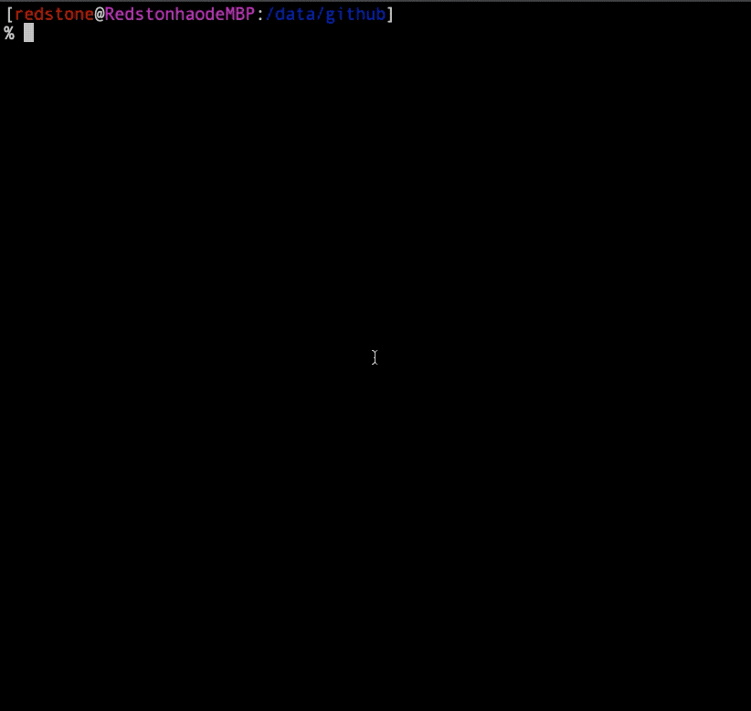

# @open-node/antman
Debug node.js process by client REPL on net socket and is silent.

# Installation
<pre>npm i @open-node/antman --save</pre>

# Usage
* your node.js process code
<pre>
const antman = require('@open-node/antman')();

// regist variable on agents object
antman.regist('key', value, 'description');

// start debugger server
antman.start(listen, secret, { expire: 30 * 60 });
</pre>

* Execute the following command then enter REPL mode to debug
<pre>
antman connect 9085
</pre>

* REPL debugger mode
<pre>
`$` is the agent whose be debugged node.js process
`help` is tips info for you
</pre>

# cli tool antman demo

<!-- Generated by documentation.js. Update this documentation by updating the source code. -->

### Table of Contents

-   [Antman][1]
    -   [regist][2]
        -   [Parameters][3]
    -   [start][4]
        -   [Parameters][5]
-   [antman][6]

## Antman

Returns **[Antman][7]** Instance

### regist

regist variable on agents

#### Parameters

-   `key` **[string][8]** 
-   `value` **any** 
-   `description` **[string][8]?**  (optional, default `"Undefined description text"`)

Returns **void** 

### start

start socket server

#### Parameters

-   `listen` **[string][8]** listen address，port or ip+port or sock-file-path, (optional, default `9085`)
-   `secret` **[string][8]** OTP secret default null, unnecessary when secret be null (optional, default `null`)
-   `opt` **[object][9]?** { expire: 900 } (optional, default `defaultOpt`)

Returns **void** 

## antman

[1]: #antman

[2]: #regist

[3]: #parameters

[4]: #start

[5]: #parameters-1

[6]: #antman-1

[7]: #antman

[8]: https://developer.mozilla.org/docs/Web/JavaScript/Reference/Global_Objects/String

[9]: https://developer.mozilla.org/docs/Web/JavaScript/Reference/Global_Objects/Object
